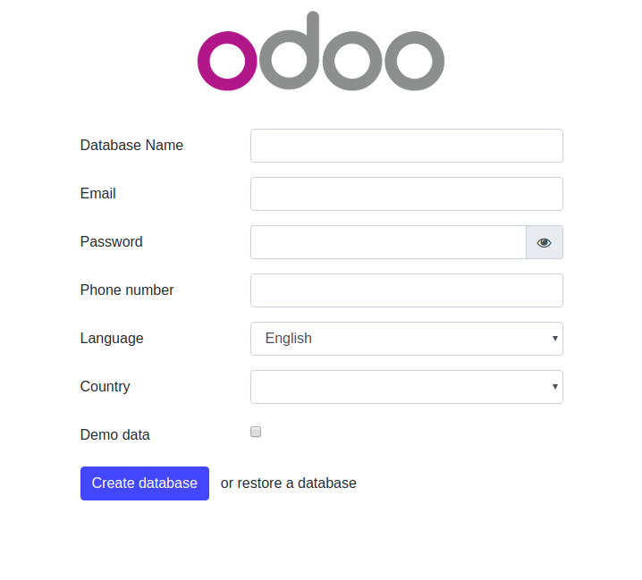
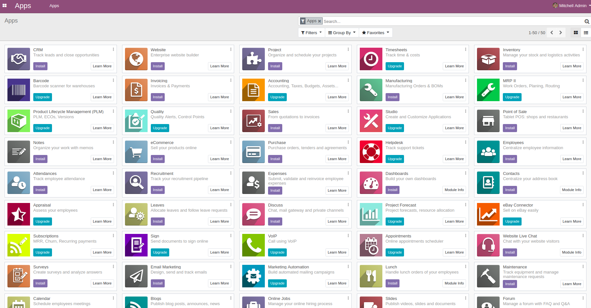
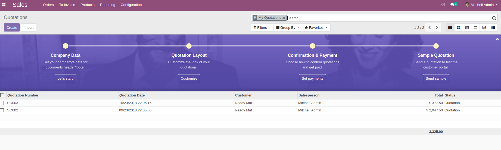

# Usage

Change the folder permission to make sure that the container is able to access the directory:
```
$ sudo chmod -R 777 addons
$ sudo chmod -R 777 custom-addons
$ sudo chmod -R 777 etc
$ sudo chmod -R 777 data
```

Start the container:
```
$ docker-compose up
```

* Then open `localhost:8071` to access Odoo 12.0. If you want to start the server with a different port, change **8071** to another value:

```
ports:
 - "8071:8069"
```

* Log file is printed @ **etc/odoo-server.log**

To run in detached mode, execute this command:

```
$ docker-compose up -d
```

# Custom addons

The **addons** folder contains custom addons. Just put your custom addons if you have any.

# Odoo configuration

To change Odoo configuration, edit file: **etc/odoo.conf**.

# Nginx configuration
<pre>
upstream odooo_retail_pos {
 server localhost:12003;
}

server {
        listen 80;
        server_name hr.scisoftware.xyz;
        location / {
            proxy_redirect off;
            proxy_pass http://odooo_retail_pos;
        }
        proxy_read_timeout 720s;
        proxy_connect_timeout 720s;
        proxy_send_timeout 720s;
        proxy_set_header X-Forwarded-Host $host;
        proxy_set_header X-Forwarded-For $proxy_add_x_forwarded_for;
        proxy_set_header X-Forwarded-Proto $scheme;
        proxy_set_header X-Real-IP $remote_addr;
        add_header Strict-Transport-Security max-age=15768000;
        client_max_body_size 100M;
}

</pre>
# docker-compose.yml

* odoo:12.0
* postgres:9.5

# Odoo 12 screenshots






